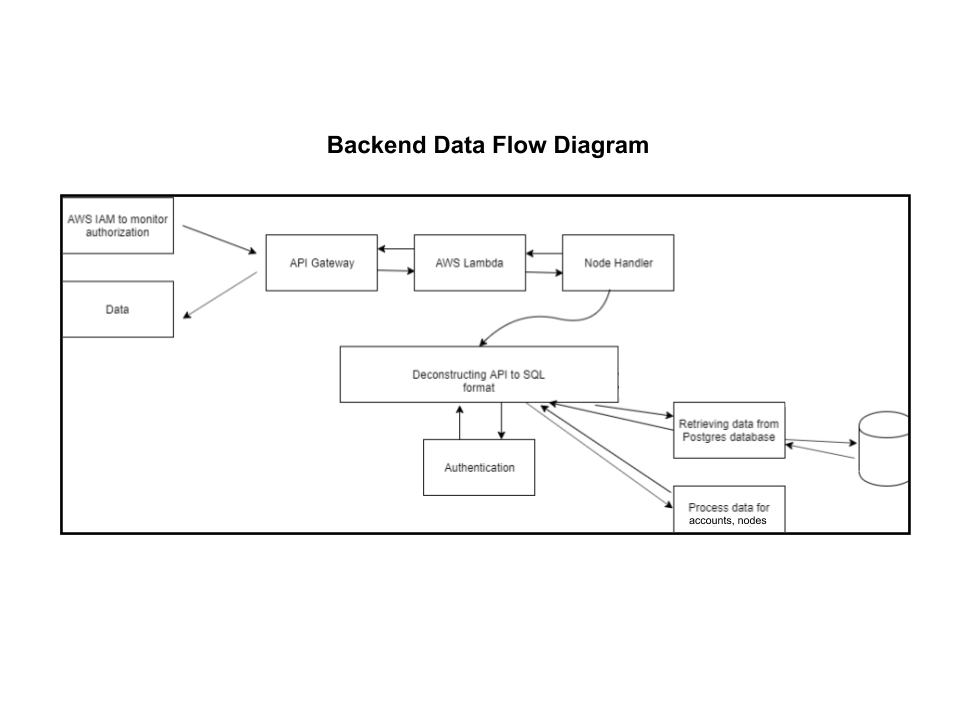

# Crowdventure Software Design Description

> By Ben Kern

## Table of Contents

1. Introduction
   1. System Objectives
   2. Hardware, Software, and Human Interfaces
2. Architectural Design
   1. Major Software Components
   2. Major Software Interactions
   3. Architectural Design Diagrams
3. CSC and CSU Descriptions
   1. Class Descriptions
      1. Node Class
      2. Account Class
      3. Choice Class
   2. Detailed Interface Descriptions
      1. Home Component
      2. Node Component
      3. Account Component
   3. Detailed Data Structure Descriptions
   4. Detailed Design Diagrams
4. Database Design and Description
   1. Database Design ER Diagram
   2. Database Access
   3. Database Security

## 1. Introduction

This document presents the architecture and detailed design for the software for the Crowdventure project. Crowdventure is a crowd-sourced interactive Choose-Your-Own-Adventure game that allows its users to play and edit/suggest content for the game as they play.

### 1.1. System Objectives

The goal of the Crowdventure application is to allow the user to navigate the various nodes (situations), as well as create content for other users to be able to interact with. The user will also be able to provide feedback in the form of likes and dislikes.

### 1.2. Hardware, Software, and Human Interfaces

#### 1.2.1. Hardware

- Crowdventure will require a computer for development.
- Crowdventure will require any device with web browser access for interactability.

#### 1.2.2. Software

- Node.js
- Yarn
- React
- Apollo Server + GraphQL
- AWS DynamoDB

#### 1.2.3 Human Interfaces

- The Crowdventure web applet will allow users to interact with the services.

## 2. Architectural Design

### 2.1. Major Software Components

- Home component
- Node component
- Account component
- GraphQL backend

### 2.2. Major Software Interactions

- Select endpoints for specific nodes and accounts
- Search endpoints for nodes, accounts, and choices
- Create/Edit/Delete endpoints for nodes, accounts, and choices
- Endpoint for making choices canon/noncanon
- Endpoint for liking/disliking choices

### 2.3. Architectural Design Diagrams

## 3. CSC and CSU Descriptions

### 3.1. Class Descriptions

#### 3.1.1. Node Class

A node holds an id for reference, an owner, a title, a content, a number of views, a list of canon choices, and a list of noncanon choices. It can be created by a user with logged in authentication, and edited and deleted by a user if it matches the owner.

#### 3.1.2. Account Class

An account holds an id for reference, a screen name, a list of created nodes, a list of suggested choices, a list of liked choices, and a list of disliked choices. Additionally, it has methods for retrieving the total suggestion score, by counting up the likes and dislikes of all suggested choices, as well as retrieving the total node views, by counting up the views of all owned nodes.

#### 3.1.3. Choice Class

A choice holsd an id for reference, an action, a to node, a from node, an owner, and a list of which accounts liked and disliked it. It has a method for counting the score, by subtracting the total amount of dislikes from the likes.

### 3.2. Detailed Interface Descriptions

All components will display whether or not the user is logged in at the moment, and, if they are not, allow them to log in. If they are logged in, it will allow them to go to their account page

#### 3.1.1. Home Component

The Home component will display a message of the day, as well as the ability to go to a starting node. This starting node can be chosen randomly, can be searched for, or can be suggested by the server from the message of the day.

#### 3.1.2. Node Component

The node component will display all information stored within a node. This includes the title, the text content, the total amount of views of the node, the owner of the node, and sub-components for all choices that are both canonical and noncanonical according to the owner of this node, which contain a link to go to the node that this choice is pointing to, as well as how many likes the choice has, and the option to like or dislike it (so long as the user is logged in). If the user is logged in, it will be allowed to suggest a choice that can go to either a new node or a preselected node. If the user is logged in and owns this node, it will be allowed to edit the node's information or delete it in the edit node component.

#### 3.1.3. Account Component

The account component will display all nodes created by the account. It will allow the user to travel to each node component represented by each node owned by the account. Additionally, it will display the total score of the user, by counting up all of the likes and dislikes of all choices suggested by the account. Futhermore, it will display the total amount of views of the user, by counting up all of the views of all the nodes the account has ownership of. If the user is logged in as the appropraite account, it will allow the user to edit any nodes owned by the account, as well as delete the account itself, if they choose to do so.

#### 3.1.4. Login Component

The login component allows an unregistered user to sign into an account, or create an account with a user name and password. After logging in, it will take the user to the account page.

#### 3.1.5. Edit Node Component

The edit node component allows the user to manipulate the content of the node, including the title, content, and which choices are canonical and noncanonical. This node should only be able to be accessed if the user owns this node. Additionally, the user can delete this node from this component, which subsequently deletes all choices stemming from this node.

### 3.3. Detailed Data Structure Descriptions

The Front end client is displayed on a webpage. This webpage can make calls to the server, which runs an apollo backend with graphql. This backend can run methods and return information to the frontend and the user, and it can make calls to the database, hosted by AWS. It can also write to the database, allowing the user to manipulate the database indirectly.

### 3.4. Detailed Design Diagrams

## 4. Database Design and Description

The database will use JavaScript, Apollo GraphQL, Amazon Cognito, Amazon Relational Database Services, Amazon API Gateway, AWS EC2, and AWS Lambda. The database engine being used is DynamoDB. Potential users include any person who has access to an internet browser

### 4.1. Database Design ER Diagram

### 4.2. Database Access

Our database will be accessed through Amazon RDS and is hosted by Amazon EC2.

### 4.3. Database Security

The security of the database is taken care of through Amazon’s EC2 service.
