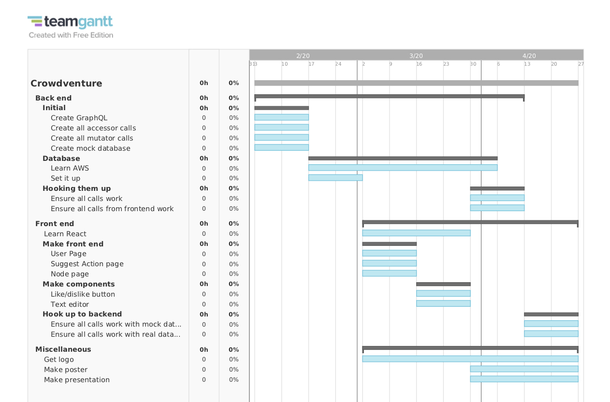
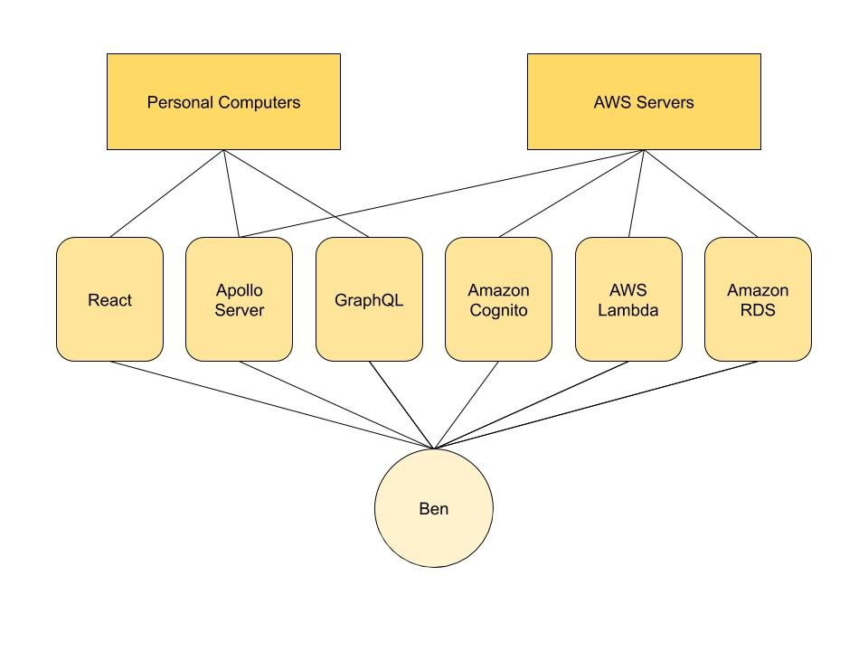

# Crowdventure Software Development Plan

> By Ben Kern

## Table of Contents

1. Plan Introduction
   1. Project Deliverables
2. Project Resources
   1. Hardware Resources
   2. Software Resources
3. Project Organization
4. Project Schedule
   1. PERT / GANTT Chart
   2. Task / Resource Table
   3. Class Schedule (optional)

---

## 1. Plan Introduction

This Software Development Plan provides the details of the planned development for the Crowdventure software, which provides an application that will allow users to play a crowd-sourced Choose-Your-Own-Adventure game.

### 1.1. Project Deliverables

#### 1.1.1. Initial Alpha Release

Target Date: June 2020

The Initial Alpha Release of Crowdventure depends only on having a basic front end and a working backend that hooks up to the database hosted by AWS cognito.
the backend shall be put into an AWS lambda function, and the frontend shall be put up on a github page.

#### 1.1.2. Public Beta Release

Target Date: January 2021

The Public Beta will be stable enough to handle multiple users from all over the internet using the application.
The Crowdventure Public Beta will have load balancers on the backend, as well as extensive security features, and a (relatively) finalized frontend look.

#### 1.1.3. Public Official Release

Target Date: TBD

Once all of the bugs have been fixed and major features have been implemented, Crowdventure will be released publicly, with plans to have advertisements to be able to support the costs of the database and the domain name.

## 2. Project Resources

### 2.1. Hardware Resources

#### 2.1.1. Crowdventure development will require a computer that is able to run a Node.js server, and support React Native development, preferably through an IDE.

#### 2.1.2. Crowdventure development will require a computer that is able to run TypeScript.

#### 2.1.3. Crowdventure development will require a computer that is able to run a Postgres DB instance for a local database for development purposes.

### 2.2. Software Resources

#### 2.2.1. Crowdventure development will require a Node.js server, and React Native development, preferably through an IDE.

#### 2.2.2. Crowdventure development will require TypeScript.

#### 2.2.3. Crowdventure development will require Postgres DB instance for a local database for development purposes.

#### 2.2.4. Crowdventure development will require a text editor or IDE for coding and editing purposes.

#### 2.2.5. Crowdventure development will require git and GitHub access.

## 3. Project Organization

### 3.1. The entire project of Crowdventure will be organized and developed by Ben Kern. This includes frontend/backend development, as well as all repository needs.

## 4. Project Schedule

### 4.1. PERT / GANTT Chart

### 4.2. Task / Resource Table

